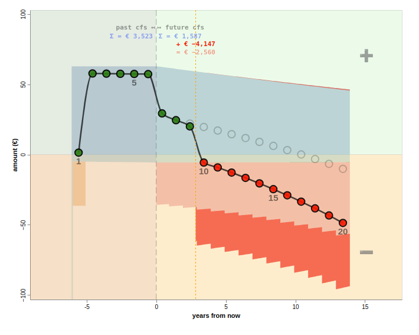

```js
const hashParams = new URLSearchParams(location.hash.slice(1));
const hash = hashParams.get('hash');
```

```js
const url0 = hashParams.get('url') ?? null;
// even though exploit risk is low, I'm using a whitelist for urls openable from hash, for now
// for now only accepting urls from calculang org; if there are other useful urls to load I'll add them
// this is really an ad-hoc/temporary solution.
const url = url0 ? (url0.startsWith('https://raw.githubusercontent.com/calculang/') ? url0 : null) : null;
```

```js
/*const watcher = window.matchMedia("(max-width: 768px) and (orientation: landscape)")

const orientation = Mutable(!watcher.matches ? "portrait" : "landscape")

watcher.addEventListener("change", e => {
  orientation.value = watcher.matches ? "portrait" : "landscape"
})*/
```

```js
// FUT: just set width and height as conditions on inner dims ??
const orientation_condition = () => (window.innerWidth > window.innerHeight*1.2) && window.innerWidth < 1370 ? "landscape" : "portrait"

const orientation = Mutable(orientation_condition())

window.addEventListener("resize", e => {
  orientation.value = orientation_condition()
})
```


<style>
label[for="interim-tab"]/*, label[for="module-relationships"]*//*, label[for="help-tab"]*/ {
  display:none
}

  /*div.card {
    margin: 0.9rem 0 !important;
    padding: 0.8rem !important;
  }*/

/*@media (max-width: 1200px) {*/ /* for small screens */
  div.card {
    margin: 0.8rem 0 !important;
    padding: 0.5rem !important;
  }
/*}*/
</style>

```js
const countCursorChgs = Mutable(-4) // 4 on init already ! (many setCursor calls). This makes it start at 0

function incCursorChgs() { countCursorChgs.value = countCursorChgs.value+1 }
```

```js
const cursor_count_1 = Mutable(false)
const cursor_count_3 = Mutable(false)
const cursor_count_20 = Mutable(false)
const cursor_count_50 = Mutable(false)
const cursor_count_100 = Mutable(false)

function hit_cursor_count_1() { cursor_count_1.value = true }
function hit_cursor_count_3() { cursor_count_3.value = true }
function hit_cursor_count_20() { cursor_count_20.value = true }
function hit_cursor_count_50() { cursor_count_50.value = true }
function hit_cursor_count_100() { cursor_count_100.value = true }
```

```js
cursor;
incCursorChgs(cursor)
```

```js
if (window.plausible) {
  if (countCursorChgs >= 1 && (!cursor_count_1)) {
    window.plausible('cursor_count', {props: {cursor_count: 1}})
    hit_cursor_count_1()
  }
  /*if (countCursorChgs >= 3 && (!cursor_count_3)) {
    window.plausible('cursor_count', {props: {cursor_count: 3}})
    hit_cursor_count_3()
  }*/
  if (countCursorChgs >= 20 && (!cursor_count_20)) {
    window.plausible('cursor_count', {props: {cursor_count: 20}})
    hit_cursor_count_20()
  }
  if (countCursorChgs >= 50 && (!cursor_count_50)) {
    window.plausible('cursor_count', {props: {cursor_count: 50}})
    hit_cursor_count_50()
  }
  if (countCursorChgs >= 100 && (!cursor_count_100)) {
    window.plausible('cursor_count', {props: {cursor_count: 100}})
    hit_cursor_count_100()
  }
}
```

<style>
.observablehq--error {
  display: none !important; /* REALLY BAD for development, OK for publish to remove screen of errors */
}

#opts {
  display: none
}

.box-2 {
  padding: 10px;
}

.reset-btn {
  background: #aaa4 !important;
  border-radius: 2px !important;
  border-bottom: none !important;
  padding: 2px !important;
  cursor: pointer;
  color: red !important;  margin-left: 0.7em !important
}


.run-reset-buttons > form {
  width: fit-content !important
}

.role-legend {
  /*display: none;*/ /* now i disable in spec */
  /*transform: translate(7px, 70px) scale(1.0)*/
}
.role-legend-label > text {
  font-family: monospace;
}
</style>

```js
display(html`
<style>
.graphs {
  display: ${graphdisplay ? "block" : "none"}
}
div#checkbox {
  background: ${(stresses_changed >0) ? "#aaa4" : "none"};
  border-radius: 2px;
  font-size: smaller;
  color:darkblue;
  padding:1px 1px;
  cursor: pointer;
  /*color: red; text-decoration: underline;*/ margin-left: 1em;
  display:inline-block
}
div#checkbox2 {
  background: ${(lapse_rate_changed) ? "#aaa4" : "none"};
  border-radius: 2px;
  font-size: smaller;
  color:purple;
  padding: 1px 1px;
  cursor: pointer;
  /*color: red; text-decoration: underline;*/ margin-left: 1em;
  display:inline-block;
  
}
</style>
`);
```


```js
setCursor({//...cursor0,
pricing_projection_in: false,
update_pricing_lapse_rates_in,
original_lapse_rates_in: null, // errors in selection_fn if i dont have every input, as entire cursor used
  data_version_in: 0, // how to support this varying with one big setCursor?
  zero_decrement_experience_in: true,
discounting_on_in: discounting_on_in,
policy_count_in: 1,
timing_in: 'BEF_NB',
age_at_entry_in: age_at_entry_in,
sex_in: sex_in,
policy_term_in: policy_term_in,
sum_assured_in: sum_assured_in,
//duration_mth_in: duration_mth_in,
mort_rate_factor_in: mort_rate_factor_in,
lapse_rate_factor_in: lapse_rate_factor_in,
//stress_delay_in: 0,
t_in: t_in,
/*expense_acq_in: 300, // draggables can't be set in this cell like this
expense_maint_in: 60,
inflation_rate_in: 0.01,
expenses_factor_in: 1,
inflation_rate_addition_in: 0,
loading_prem_in: 0.5,*/
//gender_neutral_pricing_in,
});
```

```js
setCursor({stress_delay_in:0});
```

```js
cfs_viz.view.signal('marker', cursor.stress_delay_in);
```

```js
cfs_viz.view.signal('w', width).run();
```

```js
const expenses_commissions_defaults = ({expense_acq_in: 300,expense_maint_in: 60,inflation_rate_in: 0.02,commission_pc_in: 50,commission_mths_in: 12})

setCursor(expenses_commissions_defaults);
```

```js
setCursor({expenses_factor_in: 1,inflation_rate_addition_in: 0, mort_rate_Y1_add_per_mille_in:0});
```

```js
const stress_defaults = ({expenses_factor_in: 1,inflation_rate_addition_in: 0, mort_rate_factor_in: 1,
lapse_rate_factor_in: 1,stress_delay_in: 0, mort_rate_Y1_add_per_mille_in: 0});
```

```js
setCursor({
duration_mth_in:0,
//loading_prem_in: 0.5,
});
```


```js
setFormula('pv_fut_net_cf');
```

```js
const fmt_default_1 = fmt_default

function fmt(formula, v) {
  if (typeof(v) == 'boolean') return v
  //if (formula.includes('original_lapse_rates')) return v ? true : false
  if (formula.includes('premium_due')) return v ? true : false
  if (formula.includes('_term')) return v + ' Years'
  if (formula.includes('_table')) return "[table]"
  if (formula.includes('net_cf') || formula.includes('pv_')) return d3.format(',.2f')(v)
  if (formula.includes('exp') && !formula.includes('factor')) return '€ ' + d3.format(',.2s')(v)
  if (formula.includes('_mth') && !formula.includes('inflation_rate')) return v + ' months'
  if (formula == 't') return `month ${v}`
  if (formula.includes('delay')) return `${v} mth delay`
  if (formula.includes('rate_addition') || formula.includes('loading_prem')) return d3.format(',.1%')(v)
  if (formula == 'duration') return `year ${v}`
  if (formula.includes('premium_pp')) return '€ ' + d3.format(',.2f')(v) // 4 places to be able to show rounding eff
  if (formula == 'expense_acq_in' || formula == 'expense_maint_in') return '€ ' + d3.format(',.2f')(v);
  if (formula == 'sum_assured' || formula == 'claim_pp') return '€ ' + d3.format(',.2s')(v);
  if (formula.includes('premium_rate_per_mille')) return '€ ' + d3.format(',.4f')(v) + ' per mille SA';
  if (formula == 'mort_rate_Y1_add_per_mille') return d3.format(',.2f')(v) + ' per mille';
  if (formula == 'inflation_rate') return d3.format(',.1%')(v)
  if (formula == 'loading_prem') return d3.format(',.0%')(v)
  if (formula.includes('_rate') && !formula.includes('delay')&& !formula.includes('mth')&& !formula.includes('factor')) return d3.format(',.3%')(v)
  if (formula.includes('factor')) return d3.format(',.0%')(v)
  if (formula.includes('_rate') && formula.includes('mth')) return d3.format(',.5%')(v)
  if (formula == 'duration_mth') return v + ' months'
  if (formula.includes('_pc')) return v + "%"
  if (typeof v == "string") return v
  if (typeof v == 'boolean') return v ? 'true' : 'false'
  if (formula.includes('pols')) return d3.format(',.5f')(v)
  if (Math.abs(v) > 1) return d3.format(',.2f')(v)
  return d3.format(fmt_default_1)(v)
  //return v
}
```


<!-- @include: ./src/TEMPLATE_metal_open.md -->

<!--</div>

</div>--> <!--turns off LHS-->


# Actuarial Playground


<style>
.amount-option {
  display: inline-block;
  border-bottom: 2px dotted orange;
  border-bottom-style: dotted;
  padding: 0 0.2em;
  /*font-style: italic;*/
  /*font-weight:bold;*/
  text-wrap: nowrap;
  color: #0d0852;
  cursor: pointer;
}

.amount-option::first-letter {
  font-style: normal !important
}


.selected-amount-option {
    border-bottom: 3px dotted orange;
  border-bottom-style: dotted;

  font-weight: bold;
}
</style>

```js
const option = Mutable(13)
function setOption(v) {
  option.value = v
}
```


<details open class="graphs" style="background:yellow;border-radius:10px"><summary>📈</summary>

<!-- hidden for now, I have newer experiments for vizing models -->

```js
const show_renamed_fns = true
const formulae2 = [...introspection.cul_functions.values()].filter(
        (d) =>
          d.reason == "definition" || (d.reason == 'definition (renamed)' && show_renamed_fns) /*&&
          d.cul_scope_id == cul_scope_id*/
      ).map(d => 's' + d.cul_scope_id + '_' + d.name)//model['s' + d.cul_scope_id + '_' + d.name](cursor))
      .sort()
```

```js
const f = view(Inputs.select(formulae2.sort(), {label: 'ƒ', value: 's1_net_cf_' /* this does get run so setting off s0_aaa -> PV calcs */, width: 200})) // TODO keeps resetting on code edit
```

```js
//const claim_pp = _.range(0,cursor.policy_term_in+1).map(d => model[f]({...cursor, t_in:d*12-cursor.duration_mth_in}))

const claim_pp = _.range(0,model.proj_len(cursor)+1).map(d => model[f]({...cursor, t_in:d-cursor.duration_mth_in}))
```

${claim_pp_spark}


```js
const claim_pp_spark = Plot.plot({
  height: 80,
  width: 200,
  marginBottom: 15,
  marginTop: 15,
  marginRight: 40,
  marginLeft: 40,
  y: {axis: null},
  x: {axis: null},
  //title:'claim_pp',
  //y: {domain: [0,25], percent: true},
  marks: [
    //Plot.axisX({anchor: "bottom", label: 'duration (yrs)'}),
    //Plot.axisY({anchor: "left", label: 'lapse_rate % p.a. (incl. applicable stress)'}),
    Plot.lineY(claim_pp, {
      stroke: 'purple',
      curve: 'step-after',
      strokeWidth: 3,
      tip: {
        format: {
          x: true,
          y: true,
          y: d => d3.format(',.7f')(d)//d.toFixed(1) + '%'//d3.format(',.1%')(d)
        },
        stroke: 'transparent',
      }
    }),

    Plot.ruleY([0], {stroke: 'black'})

  ]
})
```

</details>


<details id="msg" open style="margin-bottom: 2em; margin-top:1em; background-color:#eef; padding: 1px 5px; border-radius: 10px">

<summary style="margin-top:4px">For a <strong>simple term insurance product</strong>, this interactive playground calculates and visualizes <strong><a href="https://calcwithdec.dev/posts/actuarial-terms-i">actuarial cashflows</a></strong></summary>

<style>
.l {
  font-weight: bold;
}

.l-premiums { color:#4E79A7 }
.l-claims { color:#E15759 }
.l-expenses { color: #76B7B2 }
.l-commissions {color: #F28E2B}

/*['#4E79A7','#E15759','#F28E2B','#76B7B2', '#aaa']*/

.circle {
  margin-bottom:-3px
}
</style>

<div style="margin-top:1em; margin-bottom:0.4em">

<style>
/* copying/editing from actuarial-terms-i CalcWithDec.dev */
  @keyframes colours {  
  0% { background-color: rgba(0, 255, 128, 0.2); }
  30% { background-color: rgba(255, 192, 203, 0.2); }
  51% { background-color: rgba(211, 113, 203, 0.2); }
  80% { background-color: rgba(255, 165, 0, 0.2); }
  100% { background-color: rgba(0, 255, 128, 0.2); }
}
.active-button {
    animation-name: colours; 
    animation-iteration-count: infinite;  
    animation-duration: 5s;
  }
  .slider-box:hover, .active-button:hover, #checkbox:hover, #checkbox:has(input:checked) {
    animation-play-state: paused;
  }
</style>

```js
html`<style>
#checkbox {
  ${(stresses_changed >0) ? `animation-name: colours; 
    animation-iteration-count: infinite;  
    animation-duration: 6s;` : ""}
}
</style>`
```

```js
html`🚀 <a class="active-button plausible-event-name=Action+To+Tweeks" style="border-radius: 4px; padding: 1px" href="#action-tweeks" onclick=${(e) => {  e.preventDefault();
  const element = document.querySelector('#action-tweeks');
  const elementRect = element.getBoundingClientRect();
  const absoluteElementTop = elementRect.top + window.scrollY;
  const middle = absoluteElementTop - (window.innerHeight / 2);
  window.scrollTo({
    top: middle,
    behavior: 'smooth'
  })}}>Inspect and tweak <strong>model point</strong>, <strong>assumption</strong>, <strong>stress</strong> and <strong>pricing</strong> parameters below the visual ⬇️</a> 🔧`
```

<p style="margin-bottom:0em; margin-left: 0.5em; margin-right: 0.5em; line-height:1em;  border: 1px solid lightgrey; padding:3px; background: color-mix(in srgb, lightyellow 80%, transparent); display:inline-block">
<span style="font-size:0.8em"><strong>🎥 Video</strong>: <a style="font-weight:bold" href="https://www.youtube.com/watch?v=S-cX7CmH0eA" target="_blank">on Youtube</a> watch me <strong>sense-check the Premium calculation and explore cross-subsidies</strong> (<a style="" href="https://www.youtube.com/watch?v=S-cX7CmH0eA" target="_blank">7mins</a>)</span>
</p>

<p style="margin-bottom:0em; margin-left: 0.5em; margin-right: 0.5em; line-height:1em; margin-top: 0.5em;border: 1px solid lightgrey; padding:3px; background: color-mix(in srgb, lightyellow 80%, transparent); display:inline-block">
<span style="font-size:0.8em"><strong>🧪 Experimental</strong>: inspect and tweak <strong><i><a href="https://calculang.dev">calculang</a> formulas</i></strong> under 💬</span>
</p>

</div>

</details>

<div style="display:flex; gap: 2em; flex-wrap: wrap; align-items: center">

<span class="amount-option" style="-webkit-touch-callout: none; user-select: none; background-color:#e9faffad; border-radius:4px; padding: 2px 5px"><label style="cursor:pointer">**Summary dots** <svg class="circle" viewBox="0 0 10 10" style="display:inline;width:14px; height: 14px;"><circle style="stroke-width:1px; stroke: black; fill:red" cx="50%" cy="50%" r="4" /></svg><svg class="circle" viewBox="0 0 10 10" style="display:inline;width:14px; height: 14px;"><circle style="stroke-width:1px; stroke: black; fill:green" cx="50%" cy="50%" r="4" /></svg><svg class="circle" viewBox="0 0 10 10" style="display:inline;width:14px; height: 14px;"><circle style="stroke-width:1px; stroke: black; fill:green" cx="50%" cy="50%" r="4" /></svg><svg class="circle" viewBox="0 0 10 10" style="display:inline;width:14px; height: 14px;"><circle style="stroke-width:1px; stroke: black; fill:red" cx="50%" cy="50%" r="4" /></svg> ${Inputs.bind(html`<input style="margin-left:3.5em" type="checkbox">`, show_summary_Input)}<br/><small>*Summarise **average total cashflow** in **each policy year***</small></label></span> 

<style>
button.inlined { 
 all: unset;
 background-color:#e9faffad;
   border-bottom: 2px dotted orange;
  border-bottom-style: dotted;

 cursor: pointer;
 &:focus-visible {
   outline: 2px solid black;
 }
}</style>

```js
html`<span class="amount-option" style="-webkit-touch-callout: none; user-select: none; background-color:#e9faffad; border-radius:4px; padding: 2px 5px;"><label class="inlined"><strong style="cursor: pointer">Discount future cashflows? 📉</strong> ${Inputs.bind(html`<input type="checkbox">`, discounting_on_in_Input)}</label></span>`
```

</div>

<br/>

```js
html`📙 <span class="l l-premiums">Premiums</span> are a <button class="inlined"  onclick=${() => {    document.querySelectorAll(".concat_0_concat_0_layer_0_marks").forEach(e => {
      e.firstChild.classList.remove('introduceOO')
      e.firstChild.focus(); // force reflow? https://gist.github.com/paulirish/5d52fb081b3570c81e3a
      e.firstChild.classList.add('introduceOO')
    })
}} class="amount-option" style="-webkit-touch-callout: none; user-select: none; background-color: color-mix(in srgb, lightgreen 20%, transparent); border-radius:4px; padding: 2px 5px;">➕ cashflow</button> and <span class="l l-expenses">Expenses</span>, <span class="l l-commissions">Commissions</span>, and <span class="l l-claims">Claims</span> are <button onclick=${() => {    document.querySelectorAll(".concat_0_concat_0_layer_1_marks").forEach(e => {
      e.firstChild.classList.remove('introduceO1')
      e.firstChild.focus(); // force reflow? https://gist.github.com/paulirish/5d52fb081b3570c81e3a
      e.firstChild.classList.add('introduceO1')
    })
}} class="amount-option inlined" style="-webkit-touch-callout: none; user-select: none; background-color: color-mix(in srgb, orange 20%, transparent); background-opacity:0.1; border-radius:4px; padding: 2px 5px;">➖ cashflows</button>`
```


```js
//const discounting_on_in = form[1]//view(Inputs.toggle({value:true, label:'Discount future cashflows?'}))
```

```js
window.v = cfs_viz.view;
```


```js
  cfs_viz.view.signal('show_summary', show_summary).run(); // Am I duping on run?
```

```js
// to inspect cache:
//Object.keys(model.s1_pv_fut_premiums$m.cache)//
```

```js
//model.s1_pv_fut_premiums(cursor)
```

```js

// ex PV calls here have a big drag on performance profile -
// A lot of calcs already done in calcudata call, but not discounting which is slow interactively
// (do sum on calcudata result Fast option?)

cfs_viz.view.signal('pv_fut_net_cf_fut_A', /*model.pv_fut_net_cf({...cursor,t_in:0, mort_rate_factor_in:1, lapse_rate_factor_in:1,stress_delay_in:0, expenses_factor_in:1,mort_rate_Y1_add_per_mille_in:0, inflation_rate_addition_in:0})*/ stats.reduce( (a,v) => (a + ((v.future && (v.input_cursor_id == 0)) ? v.total : 0)), 0) ).run(); // run added to ensure syncing on stress, was redundant when using model calls and not stats
```

```js
const stats = cfs_data.derive({future: d => d.t_in >= 0}).groupby('future','input_cursor_id')
.rollup({
  total: d => aq.op.sum(d.value)
}).objects();

//display(Inputs.table(stats))
```

```js
//display(stats.reduce( (a,v) => (a + ((v.future && (v.input_cursor_id == 0)) ? v.total : 0)), 0))

//stats.reduce((a,v) => a + (v.future && (v.input_cursor_id == 0) ) ? v.total : 0), 0)
```


```js
cfs_viz.view.signal('pv_fut_net_cf_past', stats.reduce( (a,v) => (a + ((!v.future && (v.input_cursor_id == 0)) ? v.total : 0)), 0) /*model.pv_fut_net_cf({...cursor,t_in:-cursor.duration_mth_in}) - model.pv_fut_net_cf({...cursor,t_in:0})*/);//.run()
```
```js
cfs_viz.view.signal('pv_fut_net_cf_fut_B', /*model.pv_fut_net_cf({...cursor,t_in:0})*/ stats.reduce( (a,v) => (a + ((v.future && (v.input_cursor_id == 1)) ? v.total : 0)), 0));
```


<style>
#viz {
  /*padding: 40px;
  margin: 20px;
  border: 10px solid aqua;
  border-radius: 20px;*/
}

.vega-embed {
  touch-action:none !important;
}
.vega-embed canvas {
  touch-action:none !important;
}
</style>


<div id="viz" style="touch-action:none/*;touch-manipulation:none*/ /*margin: 0 auto*/"></div><div id="viz0"></div>


<div style="opacity:0">

### action-tweeks

</div>

<div class="card">
<details class="plausible-event-name=Model+Point+Drawer"><summary>model point ⚙️ <span style="margin-left:10px; font-style:italic">${age_at_entry_in} <span title="years old" style="border-bottom: 1px dotted black">yo</span> ${sex_in}, € ${d3.format(',.3s')(sum_assured_in)} <span title="sum assured" style="border-bottom: 1px dotted black">SA</span> <!--${policy_term_in} yr term, --><!--${cursor.duration_mth_in ? html`<span title="in-force projection (positive duration)" style="border-bottom: 1px dotted black">IF</span>` : html`<span title="new business projection (duration = 0)" style="border-bottom: 1px dotted black">NB</span>`}--></span> ${cursor.duration_mth_in ? (nb) : ""}</summary>

```js
const nb = html`<button class="reset-btn inlined" title="Go to new business projection (duration = 0 months)" onclick=${(e) => {setCursor({'duration_mth_in': 0});  e.stopPropagation(); if (window.plausible) window.plausible('NB_button') /*e.preventDefault()*/ }}>NB</button>`
```

```js
const sum_assured_in = view(Inputs.range([100000,1000000], {label: 'sum assured', value: 300000, step:1000}))
const age_at_entry_in = view(Inputs.range([20,59], {label: 'age @ start', value: 40, step:1}))
const sex_in = view(Inputs.radio(['M','F'], {label: 'sex', value: 'M'}))
const policy_term_in = view(Inputs.select([10,15,20], {label: 'term (years)', value: 20, width: 100}))
```
```js
const duration_mth_in = 0;// view(Inputs.range([-5*12,20*12], {label: 'duration inforce', value: 30, step:1}))
```

<!-- ZOOM OUT LEVEL CAN MAKE THIS FRACTIONAL - DO A ROUND TO STEP MULTIPLE CHK?   -->
duration <span style="line-height:1em; border: 1px solid lightgrey; padding:3px; background: lightyellow; display:inline-block">
<span style="font-size:0.8em">📣 <span class="input f" style="padding:5px;  font-style:italic">drag me</span> ↔️ 👉</span>
</span>: ${draggable_input({input:'duration_mth_in', value: 0, step:1})}

<!--⇒ projection type <span class="f status"></span>-->


</details>
</div>


```js
const expenses_commissions_changed = Object.keys(expenses_commissions_defaults).reduce((a,v) => a + (cursor[v] == expenses_commissions_defaults[v] ? 0 : 1), 0)
```

```js
const expenses_commissions_zero_obj = Object.keys(expenses_commissions_defaults).reduce((a,v) => {a[v] = 0; return a}, ({}))

const is_expenses_commissions_zero_obj = Object.keys(expenses_commissions_defaults).reduce((a,v) => a + cursor[v] == 0 ? 0 : 1, 0)
```

<!-- plausible/analytics note: I can't track button use inside drawers that are being tracked! (by class) (or because dynamic inserted) => sending custom events for them (stopPropagation prevents drawer event being sent) -->

```js
const expenses_commissions_reset = html`<button class="reset-btn inlined" onclick=${(e) => {setCursor(expenses_commissions_defaults); e.stopPropagation(); if (window.plausible) window.plausible('expenses_reset') /*e.preventDefault()*/ }}>Reset</button>`
```

```js
const expenses_commissions_zero = html`<button class="reset-btn inlined" style="color:purple" onclick=${(e) => {setCursor(expenses_commissions_zero_obj); e.stopPropagation(); if (window.plausible) window.plausible('expenses_zero') /*e.preventDefault()*/ }}>Zero</button>`

```

<div class="card">
<details class="plausible-event-name=Expenses+Commissions+Drawer"><summary><span class="l l-expenses">expenses</span> & <span class="l l-commissions">commissions</span> ⚙️ ${!is_expenses_commissions_zero_obj ? "" : expenses_commissions_zero} ${(expenses_commissions_changed >0) ? expenses_commissions_reset : ""}</summary>

<!-- TODO show PV_futs someplace? -->


acquisition expenses ${draggable_input({input:'expense_acq_in', value: 300, step:2})}, maintenance expenses ${draggable_input({input:'expense_maint_in', value: 60, step:2})} p.a. payable monthly, inflating by ${draggable_input({input:'inflation_rate_in', value: 0.01, step:0.0005})} p.a. from policy start

commissions ${draggable_input({input:'commission_pc_in', value: 100, step:1})} of first ${draggable_input({input:'commission_mths_in', value: 12, step:1})} of premiums

<span style="line-height:1em; border: 1px solid lightgrey; padding:3px; background: lightyellow; display:inline-block">
<span style="font-size:0.8em">📣 <span class="input f" style="padding:5px;  font-style:italic">drag me</span> ↔️ ☝️</span>
</span>

</details>
</div>


```js
const stresses_changed = Object.keys(stress_defaults).reduce((a,v) => a + (cursor[v] == stress_defaults[v] ? 0 : 1), 0)
```

```js
const stresses_reset = html`<button class="reset-btn inlined" onclick=${(e) => {setCursor(stress_defaults); set(mort_rate_factor_in_Input,stress_defaults.mort_rate_factor_in); set(lapse_rate_factor_in_Input,stress_defaults.lapse_rate_factor_in);set(stress_delay_in_Input,stress_defaults.stress_delay_in); set(highlighting_Input,false);  e.stopPropagation(); if (window.plausible) window.plausible('highlighting_toggle') /*e.preventDefault()*/ }}>Reset</button>`
```

<style>
#highlighting_checkbox {
  background: red;
  cursor:pointer;
}
label[for="highlighting_checkbox"] {
  /*background: red;*/
  cursor:pointer;
}

div#checkbox {
  /*background: pink;
  display:inline;
  padding: 2px;*/
}
</style>

```js
html`<style>.stress_delay_in {background: color-mix(in srgb, #f52525 60%, transparent) !important; color:black;font-size: smaller; padding: 3px 1px;display: ${(stresses_changed >0) ? 'inline' : 'none'}}</style>`
```

<!-- tricky to make the delay draggable animate with colours keyframes, probably due to dom mutations? overlay poss but bad -->

<div class="card">
<details class="plausible-event-name=Stresses+Drawer"><summary>stresses ⚙️ ${(stresses_changed >0) ? stresses_reset : ""}<span style="margin-left:0.5em">${draggable_input({input:'stress_delay_in', value: 0, step:1})}</span><div id="checkbox">${(stresses_changed >0) ? Inputs.bind(html`<input id="highlighting_checkbox" type="checkbox">`, highlighting_Input) : ''} ${(stresses_changed >0) ? html`<label for="highlighting_checkbox">highlight<!-- impact--></label>`: ''}</div></summary>

```js
// doesn't work as not available on init run, => set marker signal using cursor (slow?)
/*const el = document.querySelector('.stress_delay_in')
(new MutationObserver(mutations => {
  mutations.forEach(mutation => {
    if (mutation.type === 'attributes' && mutation.attributeName == 'data-v')
      console.log('UPDATE STRESS DELAY')
  })
})).observe(el, {attributes: true})*/
```

```js
const set = (input, value) => {
  input.value = value;
  input.dispatchEvent(new Event("input", {bubbles: true}));
}
```

```js
const mort_rate_factor_in_Input = Inputs.input(1)
const mort_rate_factor_in = Generators.input(mort_rate_factor_in_Input)
view(Inputs.bind(Inputs.range([0,2], {step:.02, value:1, label:'mortality assumption factor'}), mort_rate_factor_in_Input))
```

```js
const lapse_rate_factor_in_Input = Inputs.input(1)
const lapse_rate_factor_in = Generators.input(lapse_rate_factor_in_Input)
view(Inputs.bind(Inputs.range([0,2], {step:.05, value:1, label:'lapse assumption factor'}), lapse_rate_factor_in_Input))
```

one-year mortality shock ${draggable_input({input:'mort_rate_Y1_add_per_mille_in', value: 0, step:.01})}


```js
const highlighting_Input = Inputs.input(0)
const highlighting = Generators.input(highlighting_Input)
//view(Inputs.bind(Inputs.toggle({label:'highlight stress impact'}), highlighting_Input))
```

expense assumption factor ${draggable_input({input:'expenses_factor_in', value: 1, step:0.05})}, additional inflation rate p.a. ${draggable_input({input:'inflation_rate_addition_in', value: 0, step:0.001})}


```js
const stress_delay_in_Input = Inputs.input(0)
const stress_delay_in = Generators.input(stress_delay_in_Input)
//view(Inputs.bind(Inputs.range([0,20*12], {label: 'stress delay', value: 0, step:1}), stress_delay_in_Input))
```

<span style="line-height:1em; border: 1px solid lightgrey; padding:3px; background: lightyellow; display:inline-block">
<span style="font-size:0.8em">📣 <span class="input f" style="padding:5px;  font-style:italic">drag me</span> ↔️ ☝️</span>
</span>


</details>
</div>


<div class="card">
<details class="plausible-event-name=Lapses+Drawer"><summary>lapse rate assumption ⚙️ ${lapse_rate == "0" ? "" : zero_lapses} ${lapse_rate_changed ? lapse_rates_reset : ""} <div id="checkbox2">${lapse_rate_changed ? Inputs.bind(html`<input id="update_pricing_lapse_rates_checkbox" type="checkbox">`, update_pricing_lapse_rates_Input) : ""} ${lapse_rate_changed ? html`<label for="update_pricing_lapse_rates_checkbox">+update pricing basis?<!-- todo track this button use--></label>` : ""}</div></summary>


```js
const update_pricing_lapse_rates_Input = Inputs.input(0)
const update_pricing_lapse_rates_in = Generators.input(update_pricing_lapse_rates_Input)
```


*lapse rate ƒ*<!-- <small>ℹ️ changes not affecting pricing basis</small>-->

```js
const lapse_rates = _.range(0,cursor.policy_term_in+1).map(d => model.lapse_rate({...cursor, t_in:d*12-cursor.duration_mth_in}))
```

```js
const lapse_rates_default = "Math.max(0.1 - 0.02 * duration(), 0.02) // lapse rate formula\n" //newline necessary to match
```

```js
const lapse_rate_changed = lapse_rate != lapse_rates_default
```

```js
const lapse_rates_reset = html`<button class="reset-btn inlined" style="color:red; text-decoration: none !important" onclick=${(e) => {
  lapse_rate0.editor.dispatch({
    changes: { from: 0, to: lapse_rate0.editor.state.doc.length, insert: lapse_rates_default }
  });
  
  lapse_rate0.run()

   e.stopPropagation(); if (window.plausible) window.plausible('lapses_reset') /*e.preventDefault()*/ }}>Reset <span style="color:black">10% 📉 2%</span></button>`
```


```js
let lapse_rates_obj = ({})
for (let o in lapse_rates)
  lapse_rates_obj['Y'+(Number(o)+1)] = d3.format('.1%')(lapse_rates[o])
```

```js
const lapse_rate0 = Editor({value: lapse_rates_default});

const lapse_rate_Input = Inputs.input(lapse_rates_default)

const lapse_rate = Generators.input(lapse_rate_Input)

view(Inputs.bind(lapse_rate0, lapse_rate_Input))
```

```js
const zero_lapses = html`<button class="reset-btn inlined" style="color:purple" onclick=${(e) => {
  lapse_rate0.editor.dispatch({
    changes: { from: 0, to: lapse_rate0.editor.state.doc.length, insert: "0" }
  });
  
  lapse_rate0.run()

   e.stopPropagation(); if (window.plausible) window.plausible('lapses_zero') /*e.preventDefault()*/
}
}>Zero</button>`
```

```js
const lapse_rates_history = Mutable([])

const update_lapse_rates_history = function(n) {
  lapse_rates_history.value = [...lapse_rates_history.value, n]
}
```

```js
// disabling (maybe perf) update_lapse_rates_history(lapse_rates);
```

${spark}


```js
const spark = Plot.plot({
  height: 80,
  width: 200,
  marginBottom: 15,
  marginTop: 15,
  marginRight: 40,
  marginLeft: 40,
  y: {domain: [0,25], percent: true},
  marks: [
    Plot.axisX({anchor: "bottom", label: 'duration (yrs)'}),
    Plot.axisY({anchor: "left", label: 'lapse_rate % p.a. (incl. applicable stress)'}),
    /*Plot.lineY(lapse_rates_history[lapse_rates_history.length-2], {
      stroke: 'blue',
      curve: 'step-after',
      strokeWidth: 2,
      opacity: 0.5
    }),*/
    
    Plot.lineY(lapse_rates, {
      stroke: 'orange',
      curve: 'step-after',
      strokeWidth: 3,
      tip: {
        format: {
          x: true,
          y: d => d.toFixed(1) + '%'//d3.format(',.1%')(d)
        },
        stroke: 'transparent',
      }
    }),

    Plot.ruleY([0], {stroke: 'purple'})

  ]
})
```

```js
// this is informative:
//lapse_rates_history
```

</details>
</div>


```js
const pricing_defaults = ({loading_prem_in: 0.8, gender_neutral_pricing_in: false }) // turning off before video

setCursor(pricing_defaults);
```
```js
setCursor({gender_neutral_pricing_in});
```


```js
const pricing_reset = html`<button class="reset-btn inlined" onclick=${(e) => {setCursor(pricing_defaults);  e.stopPropagation(); if (window.plausible) window.plausible('pricing_reset') /*e.preventDefault()*/; gender_neutral_pricing_in_Input.value = (pricing_defaults.gender_neutral_pricing_in); gender_neutral_pricing_in_Input.dispatchEvent(new Event("input", {bubbles: true})) }}>Reset</button>`
```

```js
const pricing_changed = Object.keys(pricing_defaults).reduce((a,v) => a + (cursor[v] == pricing_defaults[v] ? 0 : 1), 0)
```

<div class="card">
<details class="plausible-event-name=Pricing+Premiums+Drawer"><summary>pricing ⚙️ & <span class="l l-premiums">premium</span> calc 🔍 ${(pricing_changed >0) ? pricing_reset : ""}</summary>

Premium rates are derived from expected claims with an ${draggable_input({input:'loading_prem_in', value: 0.5, step:0.01})} loading, based on discounted present values<!-- If the loading is enough to cover expenses and commissions the policy is profitable - is it?-->

```js
const gender_neutral_pricing_in_Input = Inputs.input(false)
const gender_neutral_pricing_in = Generators.input(gender_neutral_pricing_in_Input)
```

<style>
.gn {
  border-bottom: 2px dotted orange;
  border-bottom-style: dotted;
  padding: 0 0.2em;
  /*font-style: italic;*/
  text-wrap: nowrap;
  color: #0a008b;
  cursor: pointer;
  font-weight: bold;
}
</style>

```js
html`The rates are <button class="inlined plausible-event-name=Gender+Neutral+Basis" onclick=${() => {gender_neutral_pricing_in_Input.value = (!gender_neutral_pricing_in_Input.value); gender_neutral_pricing_in_Input.dispatchEvent(new Event("input", {bubbles: true}));}}><span class="gn">${gender_neutral_pricing_in_Input.value ? "" : "not "}gender neutral</span></button>${gender_neutral_pricing_in ? html` <i><small>(priced on <strong>female</strong> assumptions)</small></i>` : ""}`
```


```js
const premium_payment_frequencies = ["M","Y",/*"Q","H", Sync options with text array below */"single"/* single premium */]
const premium_payment_frequency_in_Input = Inputs.input("M")
const premium_payment_frequency_in = Generators.input(premium_payment_frequency_in_Input)
```

```js
const fi = premium_payment_frequencies.indexOf(premium_payment_frequency_in_Input.value)
setCursor({premium_payment_frequency_in: premium_payment_frequency_in});
```

```js
const freq = html`<button class="inlined plausible-event-name=Premium+Frequency" onclick=${() => {
  premium_payment_frequency_in_Input.value = premium_payment_frequencies[(fi+1) % premium_payment_frequencies.length]
  premium_payment_frequency_in_Input.dispatchEvent(new Event("input", {bubbles: true}));}}><span class="gn">${["per month","per annum"/*,"per quarter", "per half-year" Sync with above*/, "single premium"][fi]}</span></button>`
```

<br/>

```js
// ISSUE: This leads to recreating reactive spans: flashing color loses context
html`<details open><summary>🔍 Premium = <span class="f premium_pp_0"></span> ${freq}</summary><p><span class="f premium_rate_per_mille"></span> x <span class="f sum_assured"></span> <span title="Sum Assured" style="border-bottom: 1px dotted black">SA</span></p></details>
`
```
<!--<br/>
<span style="line-height:1em; border: 1px solid lightgrey; padding:3px; background: lightyellow; display:inline-block">
<span style="font-size:0.8em">📣 <span class="input f" style="padding:5px;  font-style:italic">drag me</span> ↔️ ☝️</span>
</span>-->

</details>
</div>


```js
const discounting_on_in_Input = Inputs.input(false)
const discounting_on_in = Generators.input(discounting_on_in_Input)
```


```js
const show_summary_Input = Inputs.input(true)
const show_summary = Generators.input(show_summary_Input)
```


```js
const premiums = 70
```


<style>
@keyframes fadeInOO {
  0% { opacity: 0.2; fill:lightgreen }
  60% { fill: lightgreen; opacity: 1; }
  80% { fill: lightgreen; opacity: 1; } /*dark theme should be black, but minor*/
  100% { opacity: 0.2; fill:lightgreen }
}

.introduceOO {
  animation: fadeInOO ease 2s;
  animation-fill-mode: forwards;  
}

@keyframes fadeInO1 {
  0% { opacity: 0.2; fill:orange }
  60% { fill: orange; opacity: 1; }
  80% { fill: orange; opacity: 1; } /*dark theme should be black, but minor*/
  100% { opacity: 0.2; fill:lightorange }
}

.introduceO1 {
  animation: fadeInO1 ease 2s;
  animation-fill-mode: forwards;  
}

.concat_0_concat_0_layer_0_marks > path {
}
</style>


```js

  cfs_viz.view.signal('highlighting', highlighting).run();

  //mort_stress_viz.signal('marker', mort_rate_factor_delay_in).run();

```

```js
import {Editor} from "./components/Editor.js";
```

```js
const default_fs = url ? ({'playground.cul.js': `import { all_cul } from '${url}';`}) : ({
  "./basicterm.cul.js": (await (await FileAttachment('./cul/basicterm.cul.js')).text())//,
  //"./pricing.cul.js": (await (await FileAttachment('./cul/pricing.cul.js')).text()),
  //"./experience.cul.js": (await (await FileAttachment('./cul/experience.cul.js')).text())
  ,  "playground.cul.js": await (await FileAttachment('./cul/playground.cul.js')).text()
  ,  "./basicterm-tables.cul.js": await (await FileAttachment('./cul/basicterm-tables.cul.js')).text()
})
```

```js
//debugger
//const lr = [...x.introspection.cul_functions.values()].find(d => /*d.cul_scope_id == 1 &&*/ (d.name == "lapse_rate" || d.name == "lapse_rate_") && d.reason.includes('definition'))
```

```js
// dyn lapse_rate causes 1x addl. run: but it's a fast one

const lr = x.old_fs["./basicterm.cul.js"] ? [...x.introspection.cul_functions.values()].find(d => d.cul_scope_id == [...x.introspection.cul_scope_ids_to_resource].find(d => d[1].includes("./basicterm.cul.js"))[0] && (d.name == "lapse_rate" || d.name == "lapse_rate_") && d.reason.includes('definition')) : undefined

// There are 2x div.compile calls when Lapse 0 button is used
await x.setFS(x.old_fs["./basicterm.cul.js"] // (x.old_fs['entrypoint.cul.js'])
? 
  ({...x.old_fs, // or old?
    // I can't use lr because that creates a loop (it works but repeats slowing down the UI)
    // 
    "./basicterm.cul.js": replaceByIndexes(x.old_fs["./basicterm.cul.js"], lr.loc.start.index+7-1/* what causes shifts when i refactor my code? */, lr.loc.end.index+1-1, lapse_rate).replace(/(all_cul)0+/g, '$1') /*if this keeps showing up, it gets added in editor.js */
    ,"playground.cul.js": x.old_fs["playground.cul.js"]//,
    ,"./basicterm-tables.cul.js": x.old_fs["./basicterm-tables.cul.js"]//,
    //"./pricing.cul.js": x.old_fs["./pricing.cul.js"],
    //"./experience.cul.js": x.old_fs["./experience.cul.js"]
  })
:
  default_fs
);
```

```js
import {cashflows_spec_patch,cashflows_spec, cashflows_keep_add_subtract, cashflows_summary} from './components/cashflows-visual.js'
```

```js
// f9535c0 is latest all_cul commit:

const calcudata = (await import("https://cdn.jsdelivr.net/gh/calculang/calculang@f9535c0/packages/calcudata/src/index.js")).calcudata
```

```js
const outputs =  ['pv_premiums','pv_claims','pv_commissions', 'pv_expenses'/*, 'pv_d_reserves'*/, 'pv_placeholder', 'pv_placeholder2'].filter(d => {return model[d] != undefined}) // necessary filter: if I ask for a formula that doesn't exist, will fail
// there are 2x HEAVY RUNS, why?
//console.log('RUNNING MODEL', model, cursor) // reacts to model, cursor, multiple times?
// fut perf idea: split into A/B calls and cursors, but would it make much difference?
// common params => need to recalc 2x unless I can detect no stress/B, stress params => calc 1x but memo etc?
```

```js

const cfs_data = calcudata({
  type: 'arquero',
  orientation: 'rows',
  models: [model],
  input_cursors: //[{...cursor, lapse_rate_in:.05}, cursor],
  [{...cursor, mort_rate_factor_in:1, lapse_rate_factor_in:1,stress_delay_in:0, expenses_factor_in:1, inflation_rate_addition_in:0, mort_rate_Y1_add_per_mille_in: 0},cursor],
    //[{...cursor, step_in:step_no-1}, {...cursor, step_in:step_no}],
  input_domains: {
    duration_mth_in: [cursor.duration_mth_in], // I need this in data atm
    t_in: _.range(
      -cursor.duration_mth_in,
      model.proj_len(cursor)+1
    )///
  },
  outputs,
})

```


```js
// don't run this at all if not highlighting
const cfs_highlights = highlighting ? cashflows_keep_add_subtract({
  cfs:cfs_data,
  varying: 'input_cursor_id'
}) : aq.from({a:[]})
```


```js
{
  if (highlighting)
    cfs_viz.view.data('B_or_keep_add_subtract', cfs_highlights.objects()).resize().run();
  else {
    // taking out of top-level so that only calcd if highlighting: improves perf
    /*const cfs_impacts = cashflows_B({
      cfs:cfs_data,
      singular: false,
      varying: 'input_cursor_id'
    })*/

    cfs_viz.view.data('B_or_keep_add_subtract', cfs_data.derive({
        //varying: (d, $) => d['input_cursor_id'], Trying to make this col redundant
        partition: (d, $) => d['input_cursor_id']
       }).objects()).resize().run();
  }
}
```

```js
{
  if (show_summary)
    cfs_viz.view.data('summary', cashflows_summary({cfs:cfs_data.filter(d => Math.abs(d.value) > 0.00001),   varying: 'input_cursor_id'}).objects());
}
```
```js
{
    cfs_viz.view.data('keep_add_subtract', highlighting ? cfs_highlights.objects() : [])
}
```

```js
cfs_viz.view.signal('panOffset', -cursor.duration_mth_in);
```


```js
cfs_viz.view.signal('show_stress_rule', cursor.stress_delay_in != 0);
```

<style>
.info p:first-child {
  margin-top: 0.2em
}
.info p:last-child {
  margin-bottom: 0.2em
}
</style>

<div class="info" style="margin-bottom:0em; margin-left: 0.5em; margin-right: 0.5em; margin-top:4em;line-height:1.5em; border: 1px solid lightgrey; padding:3px; background: lightyellow">

ℹ️ **Actuarial Playground** is a project by **[Declan Naughton](https://calcwithdec.dev/about)** - developing specialized and modern **actuarial modelling** and **actuarial analysis** tools.<br/>

☎️ <span class="active-button">**[Contact](mailto:dcnconsultingactuarial@gmail.com)**</span> to learn more, to view demos, or to discuss **modelling or visualization** *challenges* - or if you are interested in *guided introductions* to the Playground and calculang (especially if you are a **teacher** or **mentor** or if you **manage a team** with actuarial students)

</div>

<div class="info" style="margin-bottom:0em; margin-left: 0.5em; margin-right: 0.5em; margin-top:3em;line-height:1em; border: 1px solid lightgrey; padding:3px; background: lightyellow">

⚠️ **Disclaimer**: The assumptions, methodology, limitations and issues of a model should be carefully considered for any purpose you apply it to.

I haven’t noted these for this Playground: which is presented for demonstration, education & applied research purposes. <span style="font-weight: bold; display:inline-block">Use with caution 🙏</span>

<!--<p>To provide feedback or for customised or purpose-built and documented models, or visualizations of existing models and cashflows ☎️ <span class="active-button"><strong><a href="https://calcwithdec.dev">contact me</a></strong></span></p>-->


</div>

<div class="info" style="margin-bottom:0em; margin-left: 0.5em; margin-right: 0.5em; margin-top:3em;line-height:1em; border: 1px solid lightgrey; padding:3px; background: lightyellow">

To provide feedback or else for customised/purpose-built models, <span class="active-button" style="display:inline-block"><strong><a href="mailto:dcnconsultingactuarial@gmail.com">get in touch</a></strong></span>

</div>


<br/>
<br/>

<style>
  #repo {
    margin-right:4em;
    opacity: 0.4
  }
  #repo:hover {
    opacity: 1
  }
  #holder {
    display: flex;
    justify-content: flex-end;
  }
</style>

<div id="holder"><a target="_blank" href="https://github.com/declann/ActuarialPlayground.com"></a></div>

<details class="plausible-event-name=Easter+Egg+Drawer" style="margin-top:100px; opacity:0.4"><summary>🥚</summary>

```js
const graphdisplay = view(Inputs.toggle({value:false, label:'graph display?'}))
```

```js
// /* cant: resets duration */ const t_in = -cursor.duration_mth_in//view(Inputs.range([-60,250], {label:'t_in', value:0, step:1}))
// affects results in cells
const t_in = 0 //view(Inputs.range([-60,250], {label:'t_in', value:0, step:1}))
// Strictly Fixing to 0 because duration_mth is an input and a formula: bad pattern?
// when t_in moves, causes problem for it's draggable (Reactive workings would be ok?)
```

```js
const tooltip = view(Inputs.toggle({value:false, label:'tooltip?'}))
```

```js
const renderer = view(Inputs.radio(['svg','canvas'], {value: 'svg'}))
```

```js
const disable_legend_not = view(Inputs.toggle({label:'legend', value: false}))
```

```js
const disable_legend = !disable_legend_not
```


</details>


```js

const w = (orientation == "portrait") ? Math.min(width, 700)//Math.min(700,width-100)//*1.3
            : 300 // landscape rarely has much room ... todo improve i.e. ideally 2-col layout here

const cfs_viz = embed('#viz',
    cashflows_spec({ orient: 'top',step: 1, premiums, domain:[-10,250], width: w, height:w*.7 /*todo make this better for tablet?*/, highlighting:false, uis: false, formatType: "dn", xTitle:"years from now", formulaScale: {        "domain": ["pv_premiums", "pv_claims","pv_commissions", "pv_expenses", "pv_placeholder", 'pv_placeholder2'], 
     range: ['#4E79A7','#E15759','#F28E2B','#76B7B2', '#5ba053', '#ae7ca1'] // modified order from tableau10
}, highlightOpacity: 0.5 })//
, {renderer, actions, patch: cashflows_spec_patch({disable_legend,domain:[-10,250]}), tooltip, config:{customFormatTypes:true}, expressionFunctions: {
  dn: function (datum, params) {
    //debugger
    return datum/12//"hi"
  }
}});
```

```js
const replaceByIndexes = (s, startIndex, endIndex, r) => s.slice(0, startIndex) + r + s.slice(endIndex)
```

<!--<div style="height:100vh"></div>--><!-- Fixes a layout bug, remove when layout works on really large screens -->

</div>
</div>


```js
import embed from 'npm:vega-embed';
```


```js
/*(new ResizeObserver(entries => {
  //debugger
      const contentBoxSize = entries[0].contentBoxSize[0];
      document.getElementById('ans').style.width = contentBoxSize.inlineSize-10+'px'
      //document.getElementById('ans').style.height = ''//contentBoxSize.blockSize-10+'px'
            //document.getElementById('ans').textContent = contentBoxSize.inlineSize
})).observe(document.getElementById('aa'));*/
```

<!--<div>

<div>-->

<!-- @include: ./src/TEMPLATE_metal_close.md -->


